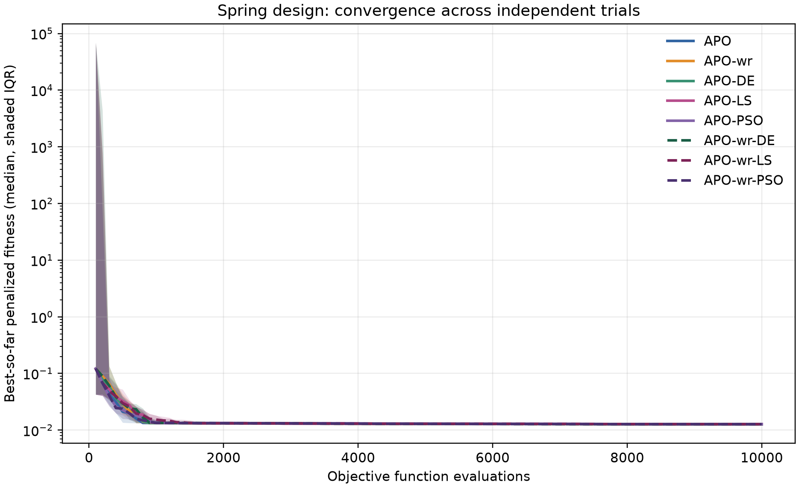
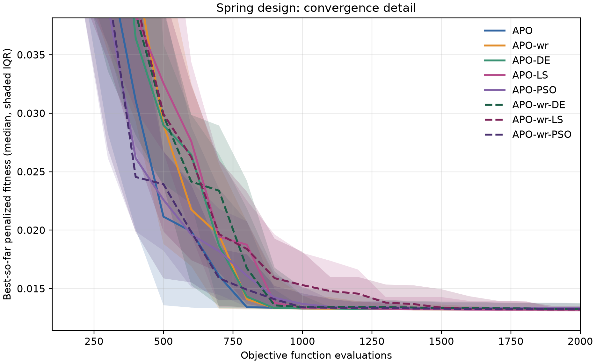
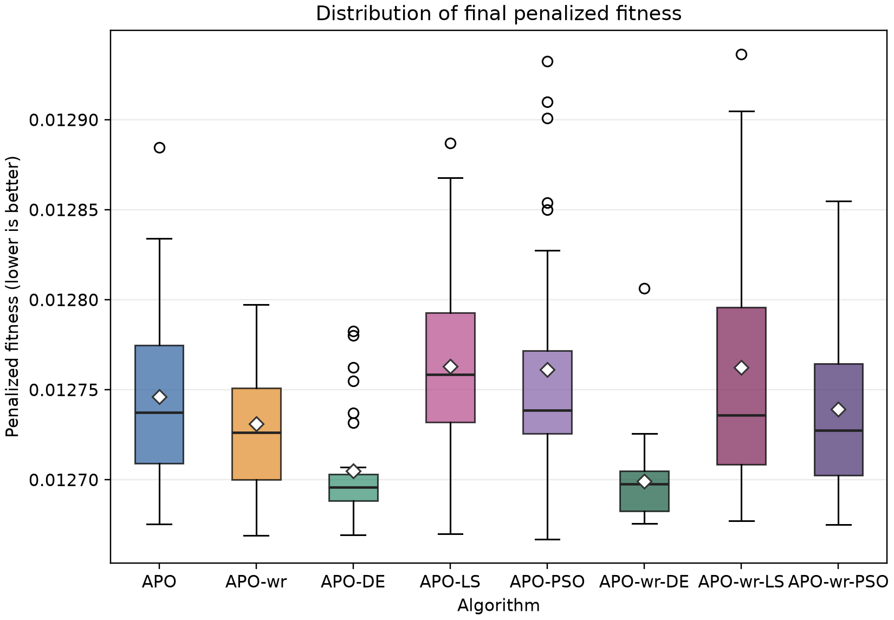
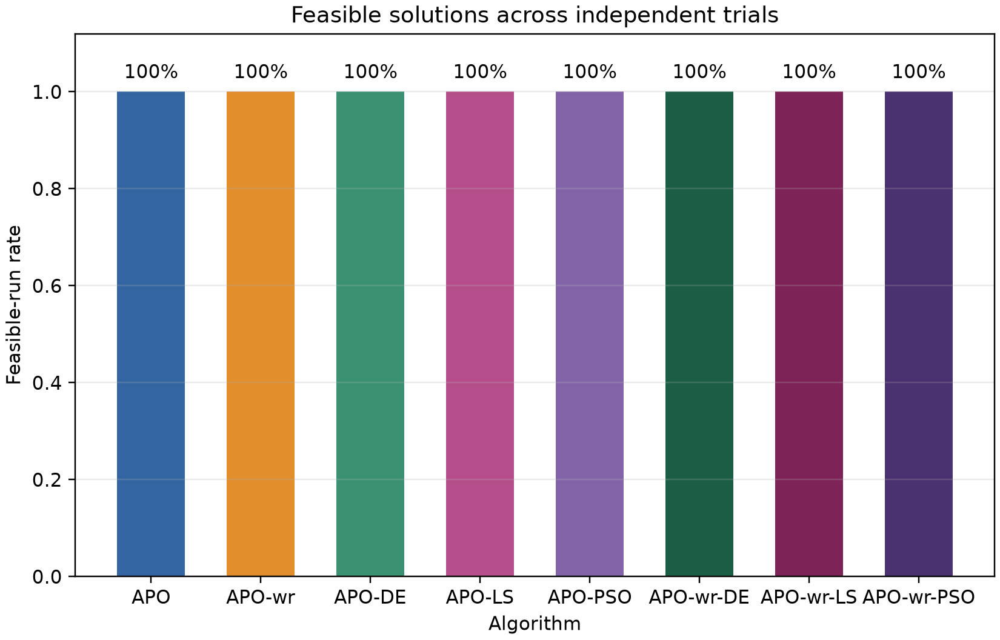
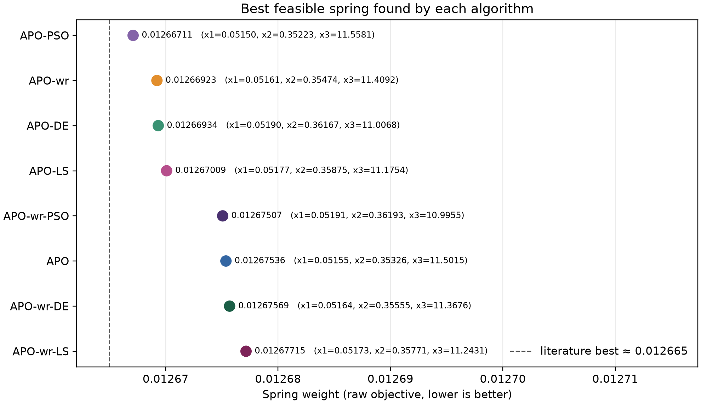

# Artificial Protozoa Optimizer experiments

This project implements the Artificial Protozoa Optimizer (APO), three APO
variants, a constrained spring-design benchmark, and a reproducible comparison
pipeline. The canonical full experiment compares **APO, APO-wr, APO-DE, APO-LS,
and APO-PSO** under a common evaluation budget. All full-run CSVs and plots are
stored together in `results_all\`.

The reference APO paper is Wang et al., *Artificial Protozoa Optimizer (APO):
A novel bio-inspired metaheuristic algorithm for engineering optimization*,
*Knowledge-Based Systems* (2024),
[doi:10.1016/j.knosys.2024.111737](https://doi.org/10.1016/j.knosys.2024.111737).
The spring benchmark experiment below is an additional engineering-problem
comparison; it should not be mistaken for an exact reproduction of the paper's
CEC benchmark experiments. APO-DE, APO-LS, and APO-PSO are project extensions,
not algorithms proposed by the paper.

## Project contents

```text
algorithms\
  apo.py                 Shared APO implementation and update mechanisms
  apo_wr.py              Rank-weighted APO wrapper
  apo_de.py              APO with DE/rand/1/bin candidates
  apo_ls.py              APO with shrinking local-search candidates
  apo_pso.py             APO with PSO candidates
  spring_design.py       Spring objective, constraints, and bounds
  run_experiments.py     Matched-seed experiment, CSVs, and statistics
  visualize_results.py   Plots generated from experiment CSVs
  test_algorithms.py     Unit and output-validation tests
results_all\
  runs.csv               One final record per method and trial
  convergence.csv        Best-so-far trace at each evaluation checkpoint
  summary.csv            Descriptive statistics per method
  statistics.csv         Paired Wilcoxon tests with Holm correction
  figures\               Five plots derived from those CSVs
requirements.txt         Python dependencies
assignment1.md           Course assignment description
```

`results_all\` is the single authoritative results directory. Previous
`results_apode\`, `results_hybrids\`, and `results_smoke\` folders are no longer
needed: their full-run data was verified to be present in `results_all\`, and
the smoke data was only a short pipeline check.

## Problem definition

The benchmark minimizes the spring material/weight objective

```text
f(x) = (N + 2) D d^2
```

where `d` is wire diameter, `D` is mean coil diameter, and `N` is the number of
active coils. The implementation uses the continuous search box
`0.05 <= d <= 2`, `0.25 <= D <= 1.3`, and `2 <= N <= 15`, and the four standard
spring-design inequalities `g_i(x) <= 0`:

```text
g1 = 1 - D^3 N / (71785 d^4)
g2 = (4D^2 - dD) / (12566 (D d^3 - d^4)) + 1 / (5108 d^2) - 1
g3 = 1 - 140.45 d / (D^2 N)
g4 = (d + D) / 1.5 - 1
```

The optimizer minimizes a squared-violation penalty:

```text
F(x) = f(x) + 1e6 * sum(max(0, g_i(x))^2)
```

The saved outputs include both the penalized fitness and raw objective. A
solution is recorded feasible when the sum of positive constraint violations
is at most `1e-8`. Bounds are clipped by the optimizer before fitness
evaluation.

## Compared methods

| Method | Update used for the hybrid portion |
| --- | --- |
| APO | Fitness-weighted APO update |
| APO-wr | Rank-weighted neighbor influence |
| APO-DE | Replaces 20% of generation candidates with `DE/rand/1/bin` (`F=0.5`, `CR=0.9`) |
| APO-LS | Replaces 10% with Gaussian perturbations around the best solution; neighborhood shrinks over time |
| APO-PSO | Replaces 10% with PSO velocity updates; inertia decreases from 0.9 toward 0.4 |

Hybrid candidates use generation slots that APO would otherwise update.
Accordingly, these variants do not receive extra objective evaluations. The
APO-LS and APO-PSO percentages and update rules are experimental choices for
this project, not claims of canonical hybrid algorithms.

## Experimental protocol

The default full comparison has 30 trials per method, population 100, and 100
iterations. Initialization evaluates 100 candidates and each of the remaining
99 generations evaluates 100 candidates, for exactly **10,000 objective
evaluations per trial**. The same trial seed is used across methods to form
paired comparisons: `2022, 2029, ..., 2225` (start 2022, step 7).

Reported measures are best, median, mean, sample standard deviation, and worst
final penalized fitness; mean raw objective; mean total constraint violation;
and feasible-run rate. The script performs two-sided paired Wilcoxon signed
rank tests for all method pairs and applies Holm's step-down correction across
the 10 comparisons. These tests evaluate observed differences on this
benchmark and configuration only; they do not establish general superiority
on other problems.

Current summary: all five methods had 100% feasible runs. APO-DE had the
lowest median penalized fitness (`0.0126959`) and was significantly better
than APO after Holm correction (`p = 0.000126`). APO-LS median was `0.0127584`
and APO-PSO median was `0.0127387`; neither differed significantly from APO
after correction. The complete values and comparisons are in `summary.csv`
and `statistics.csv`; consult those files if the experiment is rerun.

## Results figures

The plots below are generated from the full experiment in `results_all\figures\`.

### Convergence





### Final performance and feasibility





### Best feasible designs



## Setup (Windows PowerShell)

From the project root:

```powershell
python -m venv .venv
.\.venv\Scripts\Activate.ps1
python -m pip install -r requirements.txt
```

If the existing `.venv` is already active, install/update dependencies with:

```powershell
python -m pip install -r requirements.txt
```

Dependencies are NumPy for the algorithms, SciPy for paired tests, and
Matplotlib for plots.

## Tests

Run the algorithm, budget, benchmark, statistics, and visualization tests:

```powershell
python -m unittest discover -s algorithms -p "test_algorithms.py" -v
```

## Run the full experiment and plots

From the project root, run:

```powershell
python algorithms\run_experiments.py
python algorithms\visualize_results.py
```

The runner writes or replaces the four CSV files in `results_all\`. The
visualizer reads those files and writes:

- `convergence.png` — median best-so-far penalized fitness and interquartile
  range over the full evaluation budget (logarithmic fitness axis).
- `convergence_detail.png` — early-budget convergence detail.
- `final_fitness.png` — final penalized-fitness distributions.
- `feasibility.png` — feasible-run rate by method.
- `best_designs.png` — best feasible spring design found by each method.

The plotter checks that each run has a convergence trace and that the trace's
last value matches its final result. It does not execute optimizers.

To run a shorter pipeline check without overwriting the full results:

```powershell
python algorithms\run_experiments.py --trials 2 --population 12 --iterations 10 --output-dir results_smoke
python algorithms\visualize_results.py --results-dir results_smoke --output-dir results_smoke\figures
```

Smoke outputs are only for checking that experiment generation and plotting
work; do not use them as the full experimental evidence.

## Output schemas

- `runs.csv`: one row per method/trial, including seed, final penalized and
  raw objective, total constraint violation, feasibility, and decision
  variables `x1`, `x2`, `x3`.
- `convergence.csv`: method, trial, seed, objective-evaluation checkpoint,
  and best-so-far penalized fitness.
- `summary.csv`: descriptive performance and feasibility statistics by
  method.
- `statistics.csv`: pair name, Wilcoxon statistic, raw p-value,
  Holm-adjusted p-value, and adjusted significance at `0.05`.

## Reproducibility and limitations

The runner seeds NumPy separately for each method/trial pair using the common
trial seed, and records seeds and settings in the output. Each method is
stochastic; rerunning with the same settings reproduces the same values in the
same software environment. Python/NumPy versions and platform can affect
bit-for-bit reproducibility.

The spring problem is three-dimensional and the population-based methods are
implemented here for this assignment. The penalty coefficient, continuous
interpretation of the active-coil variable, and chosen hybrid parameters are
modeling/experimental decisions that should be stated in any report. The
results cannot be generalized from this one problem alone. Cite the article
and disclose the use/adaptation of external source code and generative tools
as required by the course.
